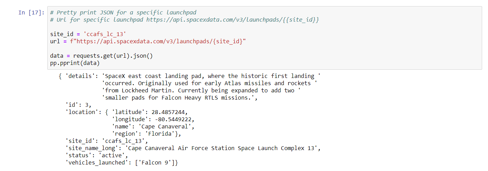

# Intro to APIs

### Goal
*Get acquainted to making requests and displaying the data in json.*
*Use **'requests'** library to send requests*
1.Explore SpaceX API documentation
2.Retrieve and print data for 'all launchpads'
3.Retrieve and print data for 'one launchpads' 

1.Explore SpaceX API documentation
[https://github.com/r-spacex/SpaceX-API/wiki]

2.Retrieve and print data for all launchpads

3.Retrieve and print data for one launchpads

