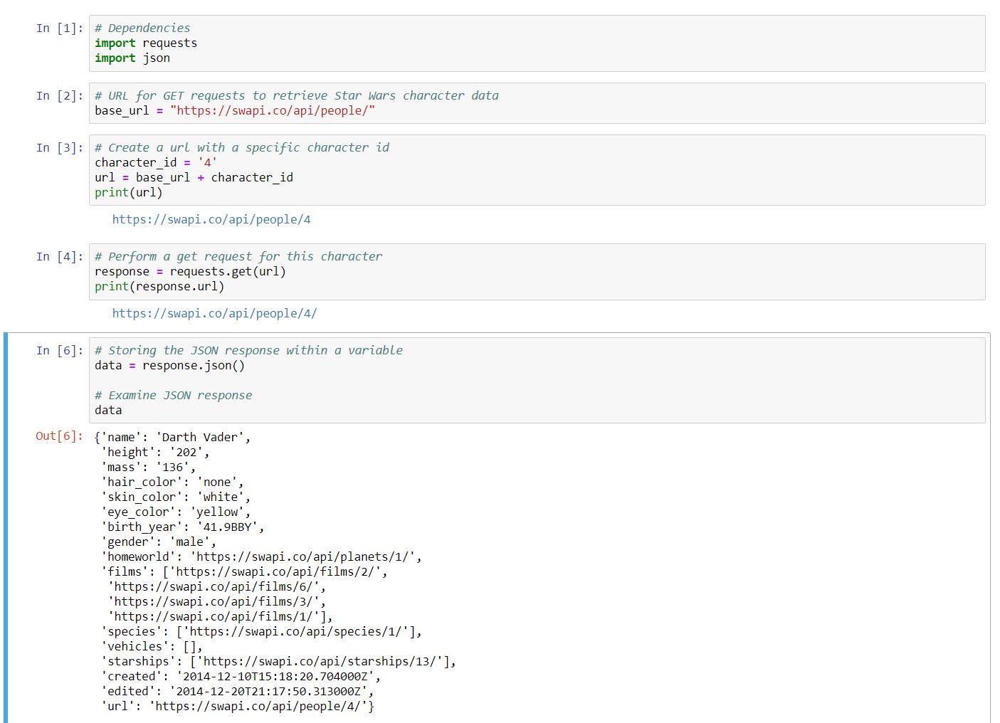

# Examining JSON Responses

```
Goals

After receiving a json response from the endpoint,

1. Get the name of the character

2. The number of films they were in

3. The name of their first ship

4. Print out data to the console

```

1. Examining the response


2. Getting the requested data and outputting it
![alt text](starwars_2.png
